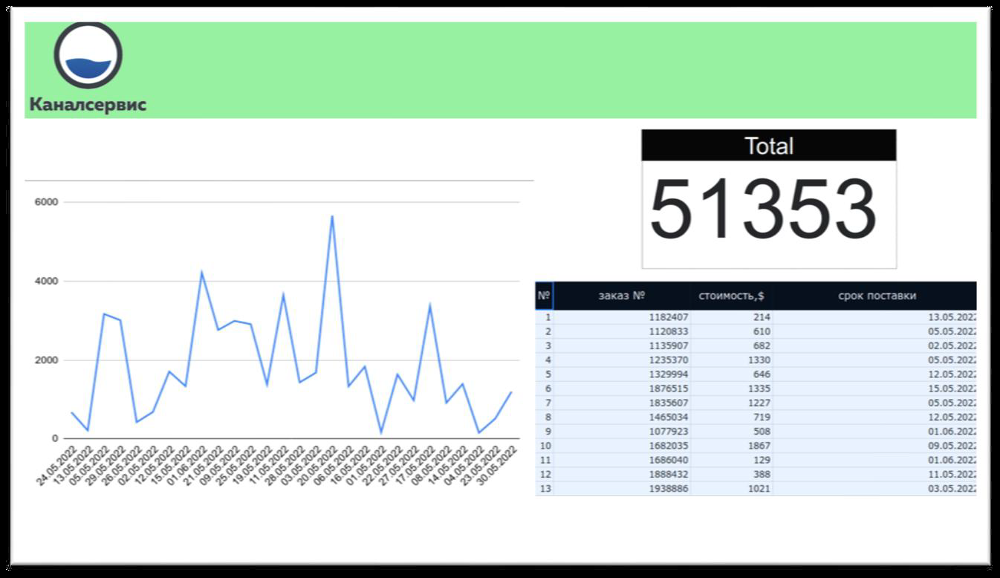

# channelservice

## Применяемые технологии:

python-telegram-bot, bs4, requests_cach, google-api-python-client, psycopg2-binary, sqlalchemy, python-dotenv

## Клонирование проекта и запуск:

```/usr/bin/bash
git clone https://github.com/zhss1983/channelservice
cd channelservice
python3 -m venv env
source env/bin/activate
python -m pip install --upgrade pip
pip install -r requirement.txt
```

## Установка Docker Compose

```/usr/bin/bash
VERSION=$(curl --silent https://api.github.com/repos/docker/compose/releases/latest | grep -Po '"tag_name": "\K.*\d')
echo $VERSION
```

В моём случае это v2.10.2

```/usr/bin/bash
DESTINATION=/usr/local/bin/docker-compose
sudo curl -L https://github.com/docker/compose/releases/download/${VERSION}/docker-compose-$(uname -s)-$(uname -m) -o $DESTINATION
sudo chmod 755 $DESTINATION
```

## Собираем БД.

TELEGRAM_TOKEN=xxxxxxxxxx:YYYYYYYY-zzzzzzzzzzzzzzzzzzzzzzzzzz
TELEGRAM_CHAT_ID=xxxxxxxxx


Теперь можно и docker-compose.yaml собрать и запустить:

```/usr/bin/bash
docker-compose up
```

Подключение к БД через pgadmin: [http://localhost:5050/browser/](http://localhost:5050/browser/)

хост **postgres**, порт **5432**.

Имя пользователя и базы данных **postgres**, пароль: **lehrjgjg** (так как проект тренировочный, секретками не заморачиваюсь).

## Тестирование проекта

### **Тестовое задание Python**

Необходимо разработать скрипт на языке Python 3, который будет выполнять следующие функции:

1. Получать данные с документа при помощи Google API, сделанного в [Google Sheets](https://docs.google.com/spreadsheets/d/1f-qZEX1k_3nj5cahOzntYAnvO4ignbyesVO7yuBdv_g/edit) (необходимо копировать в свой Google аккаунт и выдать самому себе права).
2. Данные должны добавляться в БД, в том же виде, что и в файле –источнике, с добавлением колонки «стоимость в руб.»

    a. Необходимо создать DB самостоятельно, СУБД на основе PostgreSQL.

    b. Данные для перевода $ в рубли необходимо получать по курсу [ЦБ РФ](https://www.cbr.ru/development/SXML/).

3. Скрипт работает постоянно для обеспечения обновления данных в онлайн режиме (необходимо учитывать, что строки в Google Sheets таблицу могут удаляться, добавляться и изменяться).

Дополнения, которые дадут дополнительные баллы и поднимут потенциальный уровень оплаты труда:

4. a. Упаковка решения в docker контейнер

    b. Разработка функционала проверки соблюдения «срока поставки» из таблицы. В случае, если срок прошел, скрипт отправляет уведомление в Telegram.

    c. Разработка одностраничного web-приложения на основе Django или Flask. Front-end React.


#### 1. Копирование гуглл документа:

Для копирования необходимо выполнить task_1:

```/usr/bin/bash
cd communication
python task_1.py
```

Результатом выполнения данного скрипта станет копирование переданного документа с настройкой прав доступа.

#### 2. Передача данных в БД.

База данных PostgreSQL создана в контейнере (см выше). Данные для перевода берутся с сайта ЦБРФ (функция get_course).

Для проверки разници между БД и документом необходимо выполнить task_2:

```/usr/bin/bash
cd communication
python task_2.py
```

Результатом выполнения данного скрипта станет копирование данных из google документа в БД. Удалённые записи помечаются в БД как неактивные, изменённые - меняются совместно с  документом. Обращаю внимание, что запись опознаётся по номеру заказа и если он изменится, то скрипт воспринимает это как удаление записи со старым заказом и создание нового.

Добавил функцию распознования различных форматов дат, так как человек есть человек и может ошибиться с вводом данных и не соблюсти строгий формат. Минимизировал нагрузку на БД и сеть. Применяю кеширование курса доллара.

#### 3. Скрипт работает постоянно для обеспечения обновления данных в онлайн режиме.

Для этого был написан скрипт с управлением через командную строку:

Вызов помощи:
```/usr/bin/bash
python task_3.py -h
```

Выполнение задания №1
```/usr/bin/bash
python task_3.py copy
```

Выполнение задания №3, работа в бесконечном цикле.
```/usr/bin/bash
python task_3.py check
```

Совмещение копирования файла и проверка актуальности данных в БД. Работа в бесконечном цикле.
```/usr/bin/bash
python task_3.py full
```

#### 4. Упаковка решения в docker контейнер и разработка функционала проверки соблюдения «срока поставки».

Упаковка в контейнер частично выполнена, БД перенесена в контейнер.

Выполнение однократной проверки просроченных заявок. Просроченными считаются все которые сделаны более 90 дней тому назад.
```/usr/bin/bash
python task_3.py overdue
```
При запуске с параметром **"check"** или **"full"** каждый день в **9:00** и в **17:00** будут приходить оповещения в телеграмм оповещение о просроченных заявках. Рабюотает на собственном варианте **Scheduler**-а. С другими пока не работал.

#### Разработка одностраничного web-приложения на основе Django или Flask. Front-end React.

К сожалению это не моё. Написать бэкенд к нему - не вопрос. Передать данные из БД во фронт совершенно не сложно, а вот написать к нему фронт - не смогу, javascript не владею. Мог бы выучить, но не за 2 дня и не на таком уровне что бы писать "single page applications".
